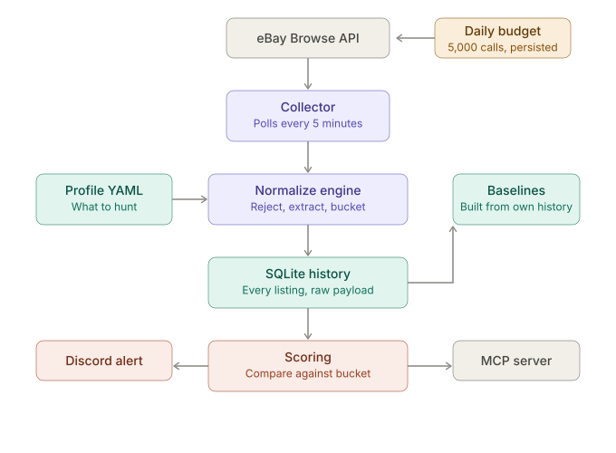

# DealWatch

DealWatch is a generic marketplace deal-monitoring engine. It polls a
marketplace for active listings matching a profile, normalizes them into a
comparable shape, scores them against a self-built price baseline, and alerts
when something is worth acting on.

First target: eBay / Lenovo ThinkPad T14. The architecture is profile-driven
and provider-driven so the second target costs a YAML file, not a rewrite.

Read `docs/design.md` before changing anything structural. It is authoritative
and the decisions in it were made deliberately.

## Two things to know up front

**There is no sold-listings API.** eBay's `findCompletedItems` is deprecated
and Marketplace Insights is Limited Release and effectively unobtainable.
DealWatch builds its price baseline from history it collects itself. See
design.md §2 before proposing anything that queries sold comps.

**Nothing here is internet-exposed.** eBay's Marketplace Account Deletion
compliance endpoint lives in a separate Cloudflare Worker repo
(`ebay-deletion-endpoint`) because it is a permanent uptime obligation that
shares nothing with this service. DealWatch binds to LAN/loopback only. Do not
fold that endpoint back in — reasoning in design.md §3.1.

## V0.1 status

- Dockerized FastAPI application, LAN-bound
- Health endpoint
- Environment-based secret/config handling
- Profile schema + validation (`dealwatch/normalize/schema.py`)
- Unit tests
- Placeholders for the eBay provider, normalize engine, collector, scoring,
  SQLite, notifier, and MCP server

## Configuration

```bash
cp .env.example .env
```

| Variable | Purpose |
| --- | --- |
| `EBAY_CLIENT_ID` | Portal calls this the App ID |
| `EBAY_CLIENT_SECRET` | Portal calls this the Cert ID |
| `DISCORD_WEBHOOK_DEALS` | Alert destination (V0.9) |
| `LOG_LEVEL` | Defaults to INFO |

Browse only needs an **application access token** via the client credentials
grant — no user token, no consent flow, no RuName. Scope is
`https://api.ebay.com/oauth/api_scope` and nothing more.

Do not commit `.env`. On the LXC, keep it on the filesystem and reference it
with `env_file:` rather than pasting values into the Portainer stack editor.

## Run

```bash
docker compose up --build -d
curl http://127.0.0.1:8087/health
```

```json
 {
    "status": "ok",
    "budget": {
        "period": "2026-08-29",
        "used": 6,
        "ceiling": 4750,
        "remaining": 4744
    }
 } 
```
> **Note:** `period` is the LA date the counter belongs to; `ceiling` is `daily_call_limit - daily_reserve_calls`.

The application listens on port 8000 inside the container and is published as port 8087 on the Docker host.

From the Docker LXC itself, the health endpoint can be reached at:
http://127.0.0.1:8087/health

From another device or service on the LAN, such as Uptime Kuma, use the Docker LXC's LAN IP:
http://192.168.99.204:8087/health

The published port binds all interfaces so LAN monitoring can reach it. The LXC is not port-forwarded and DealWatch has no authentication — this is a LAN-only service by design (see design.md §3.1).

## Development without Docker

```bash
python3 -m venv .venv
source .venv/bin/activate
pip install -e '.[dev]'
pytest
uvicorn dealwatch.main:app --reload
```

No test may require live eBay credentials to pass.

## Profiles

`profiles/*.yaml` defines what to hunt: query strings, Browse-side filters,
require/reject rules, attribute extraction, bucket keys, seed baselines, and
alert thresholds. Adding a new target should be a YAML file and nothing else —
there is exactly one normalization engine and it is generic.

Trace a title through the pipeline:

```bash
python -m dealwatch.normalize.explain \
  --profile profiles/thinkpad-t14.yaml \
  --title "Lenovo ThinkPad T14 Gen 2 Ryzen 5 PRO 5650U 16GB/512GB"
```

Profiles are validated at load. A bad regex or a `bucket_key` naming a field
no stage produces is a startup error, not a silent no-match at 2am.

## Milestones

The collector deliberately ships **before** scoring. The survival-derived
baseline needs weeks of history and that clock only starts when rows begin
landing. Every day the collector is not running is a day of comps that cannot
be recovered.

| Version | Deliverable | Status |
| --- | --- | --- |
| V0.1 | Docker + FastAPI skeleton | done |
| V0.2 | eBay OAuth (client credentials, token cache) | done |
| V0.3 | Browse API search + persisted rate-limit budget | done |
| V0.4 | Normalized `Listing` model | done |
| V0.5 | SQLite + listing history (WAL) | done |
| V0.6 | **Dumb collector loop — poll and persist, no scoring** | done |
| V0.7 | ThinkPad T14 profile + normalize engine | done |
| V0.8 | Scoring engine | next |
| V0.9 | Discord alerts | |
| V1.0 | MCP server (streamable HTTP, LAN only) | |

Ship V0.6 even though the normalizer is a stub. Raw titles and prices are
useful history, and persisting `raw_json` means the engine can be re-run over
everything already collected once it exists.

## Flow Chart 


## Operational notes

- Add `/health` to Uptime Kuma. Separately add an **external** monitor against
  the Worker's challenge endpoint — its silent death has consequences that
  otherwise go unnoticed for days.
- The SQLite listing history is the irreplaceable asset. Code is rewritable;
  three months of comps are not. Take a periodic `VACUUM INTO` dump to the NAS
  as a second copy — a live LXC backup does not guarantee a consistent SQLite
  file.
- Container runs as a non-root user; `data/` is chowned to it.
- `profiles/` mounts read-only, `data/` read-write.
